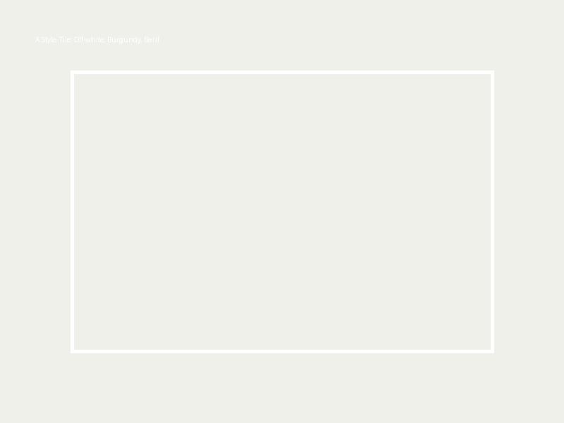
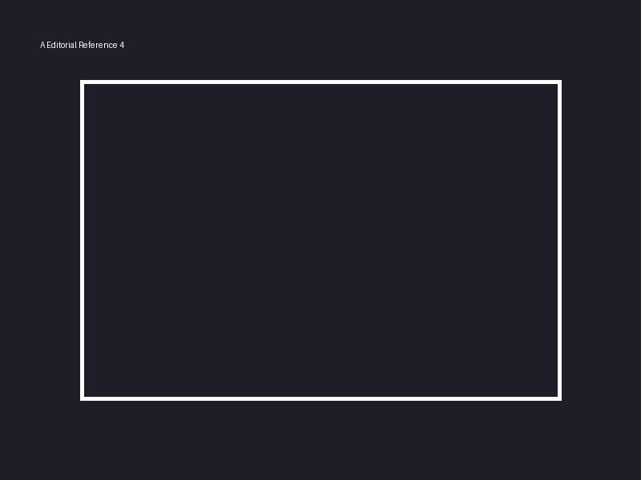
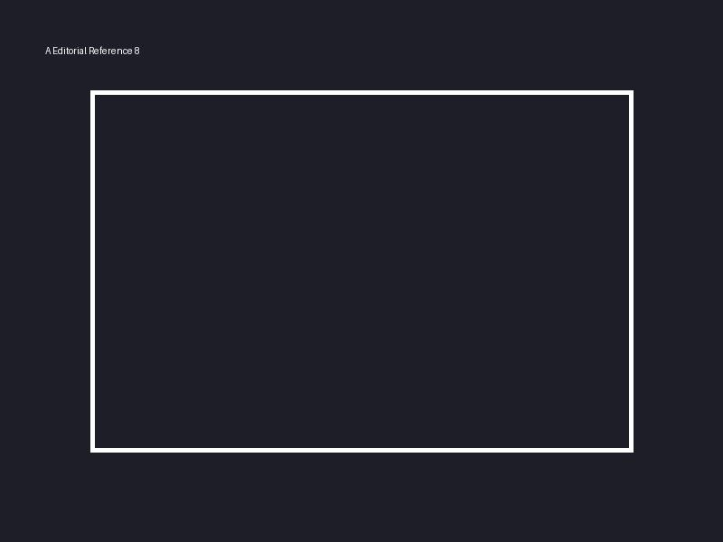
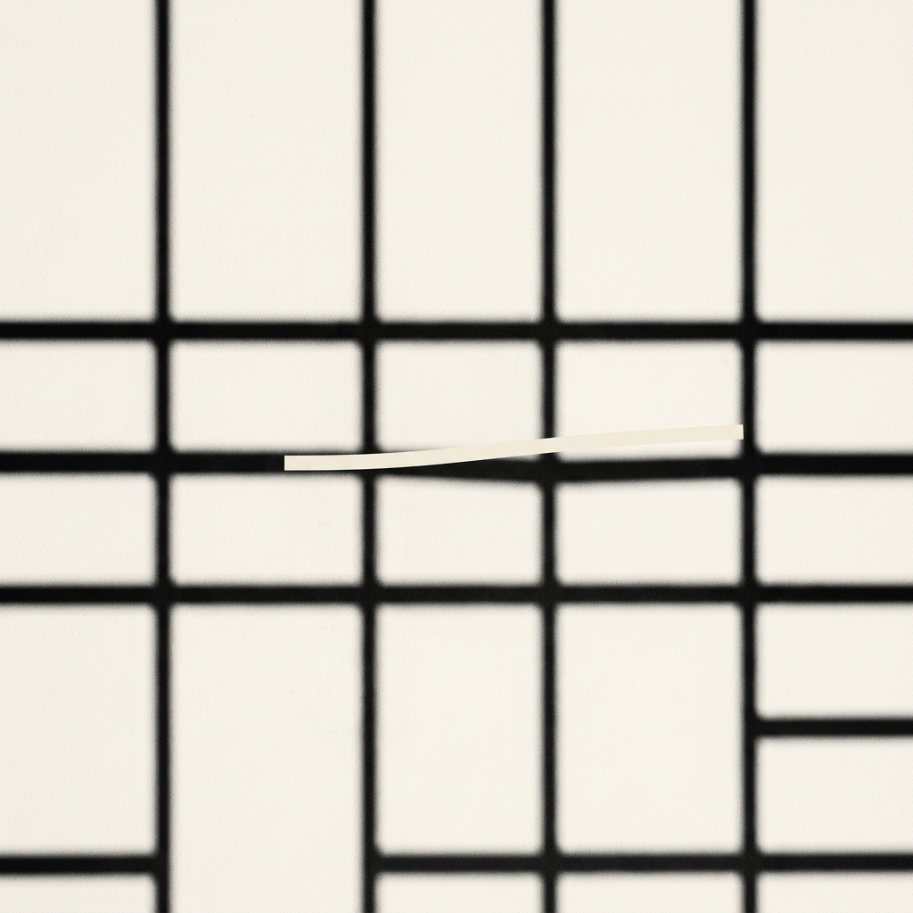

# Направление A — Editorial / Knowledge

### Концепция

Курс как серьёзное, фундаментальное знание. Визуальный язык опирается на классическую журнальную эстетику (The New York
Times Magazine, Kinfolk). Здесь много воздуха, щедрые белые поля и строгий ритм, который дисциплинирует чтение. Мы
обращаемся к интеллекту участника: это не «прокачка» и не эзотерика, это материал для вдумчивого изучения.

Метафора «открывающейся клетки» решается через игру света и тени: минималистичная сетка теней на стене, где один тонкий
луч света изгибается, ломая строгую геометрию. Это едва уловимое, интеллектуальное движение, которое не кричит, но
приглашает выйти.

### Палитра

| Роль | HEX | Назначение |
|---|---|---|
| Base | `#F7F4EE` | Основной тёплый off-white фон, имитация хорошей бумаги |
| Base-deep | `#1A1F2E` | Чернильный синий для тёмных секций и заголовков |
| Accent-1 | `#800020` | Бургунди для выделения ключевых мыслей |
| Accent-2 | `#C5A059` | Приглушённое золото для тонких линий и границ |
| Signal | `#B22222` | Глубокий красный для CTA-кнопок (строгий, не ядовитый) |
| Muted | `#333333` | Угольный цвет для наборного текста |
| Divider | `#E8DFD1` | Песочный для разделителей секций |

### Типографика

- **Заголовки (H1/H2):** `Tinos` — классический, книжный serif. Даёт ощущение достоверности и глубины.
- **Body:** `Inter` — нейтральный, чистый гротеск для безупречной читаемости лонгридов.
- **Обоснование:** Контраст между традиционным журнальным заголовком и современной цифровой антиквой в тексте транслирует соединение вековых знаний и современного инженерного подхода.

### Style tile

### Референсы
1.  — Readwise/Aeon-подобный layout (много воздуха, serif заголовки)
2.  — The NYT Magazine editorial style (крупная типографика)
3.  — Линеарная чёрно-белая графика без лишних деталей
4.  — Журнальная вёрстка в 2 колонки
5.  — Студийный портрет с мягким зерном
6.  — Тень решётки на пустой стене
7.  — Цитатный блок (крупный serif italic)
8.  — Цветовой акцент чернилами на бумаге

### Hero concept

