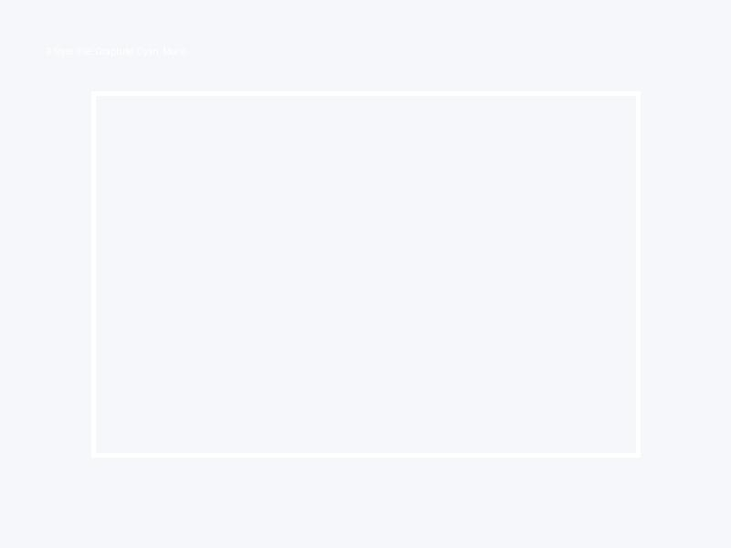
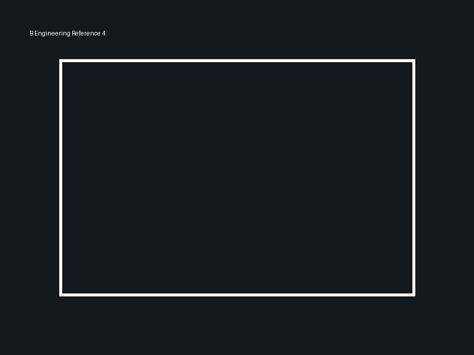
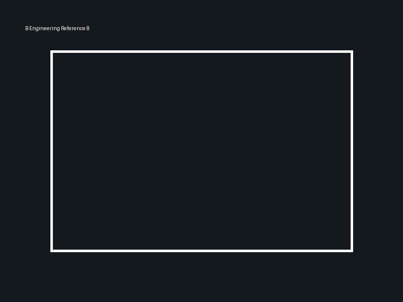
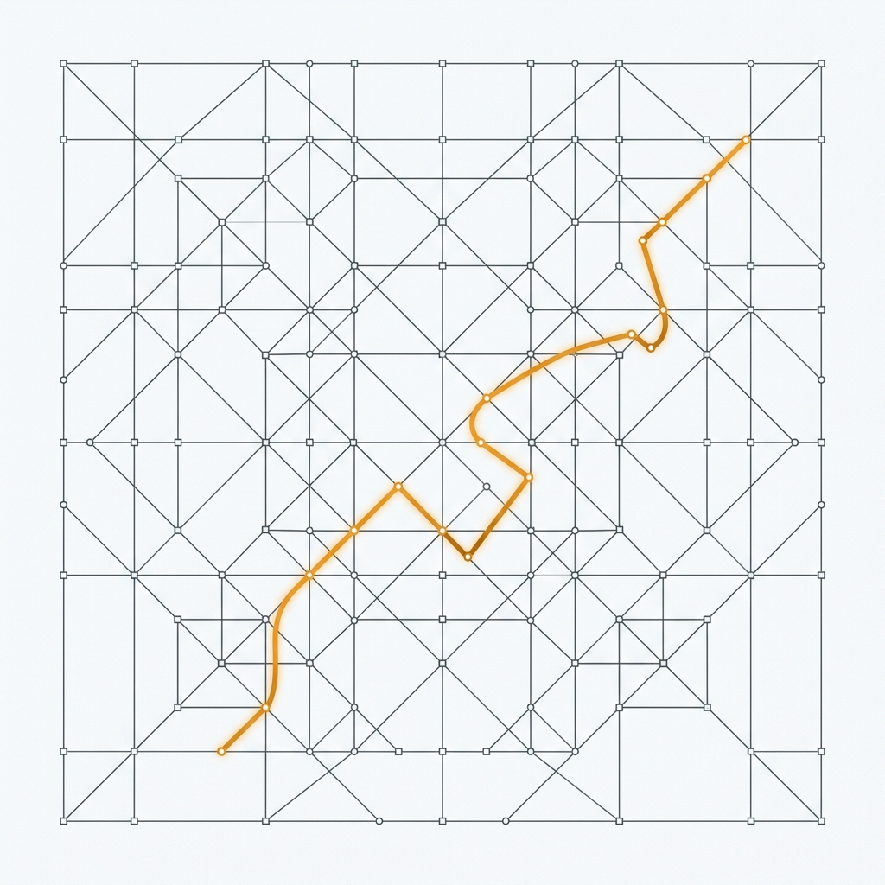

# Направление B — Engineering / Technical

### Концепция

Курс как чёткий инженерный инструмент. Разум и отношения рассматриваются как система, а блокирующие убеждения — как баги в коде. Визуально это выражается через стилистику качественной технической документации (Stripe, Vercel, Linear): чистые линии, сетки, моноширинные акценты. 

Метафора клетки здесь буквальна: строгая, холодная геометрическая координатная сетка, из которой вырывается один яркий векторный луч. Это похоже на график или архитектурный чертёж, где система находит новый, незапланированный путь наружу.

### Палитра

| Роль | HEX | Назначение |
|---|---|---|
| Base | `#F2F4F8` | Холодный off-white, экранный цвет |
| Base-deep | `#0F172A` | Тёмный сланец для инвертированных секций |
| Accent-1 | `#2B4A6B` | Сине-стальной для схем и технических блоков |
| Accent-2 | `#475569` | Графит для второстепенных линий и сеток |
| Signal | `#06B6D4` | Cyan (или янтарь) для CTA и линии «выхода» из клетки |
| Muted | `#64748B` | Светлый сланец для пояснений и сносок |
| Divider | `#E2E8F0` | Едва заметный серый для разделителей |

### Типографика

- **Заголовки и Body:** `Inter` или `Geist` — максимально чистый, геометрический sans. 
- **Акценты и термины:** `JetBrains Mono` — код, система, алгоритм.
- **Обоснование:** Использование единого гротеска для всех текстов создаёт ощущение продукта/документации, а моноширинный шрифт на терминах («клетка», «вирус») моментально переключает восприятие в инженерный режим.

### Style tile

### Референсы
1.  — Stripe Docs layout (карточки терминов)
2.  — Linear landing page (тёмный режим, свечение)
3.  — Vercel architecture diagrams
4.  — Строгая типографика с моноширинными вставками
5.  — Диаграмма: триггер → реакция
6.  — Blueprint / сетка на фоне
7.  — Студийный портрет на холодном фоне
8.  — UI-карточки терминов словаря

### Hero concept

