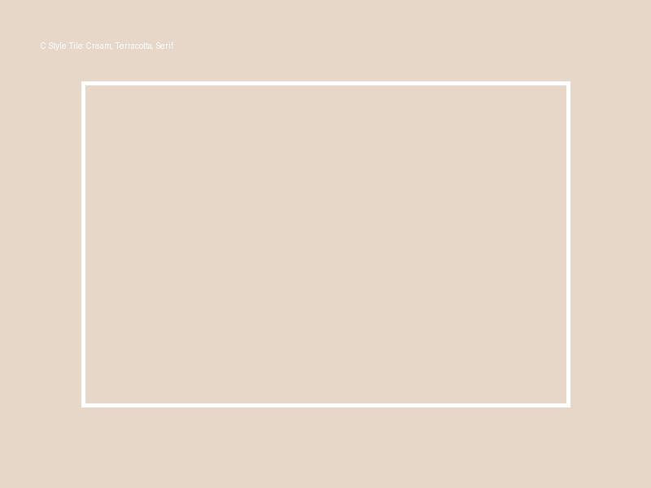
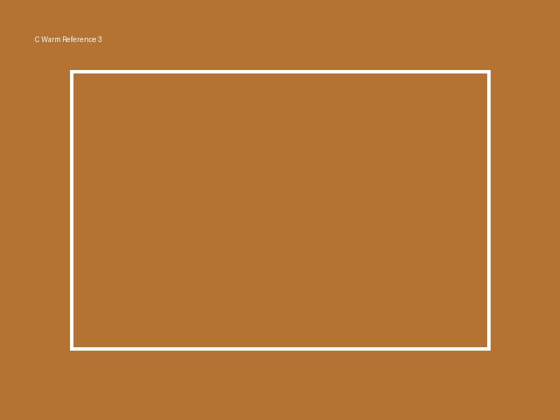
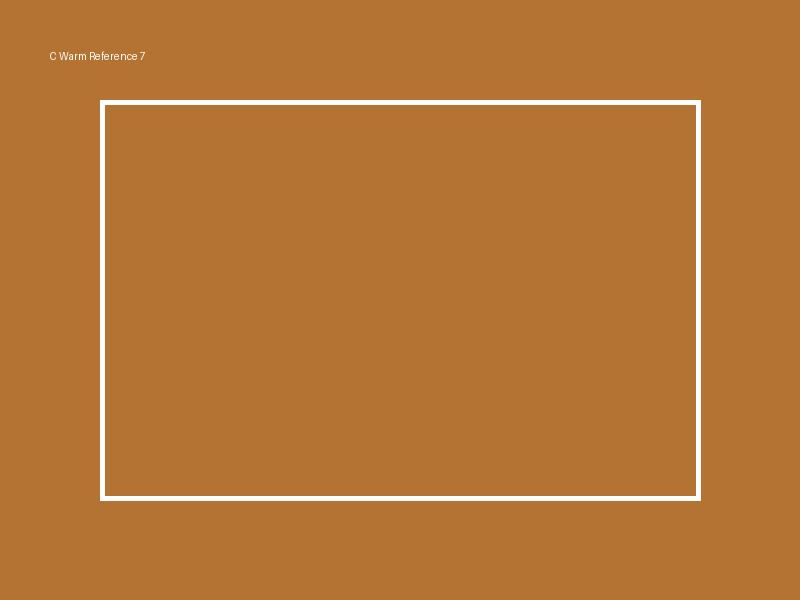
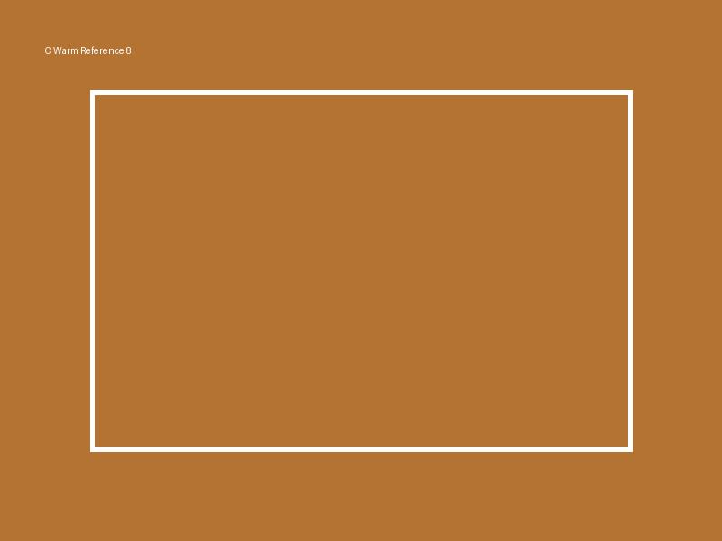
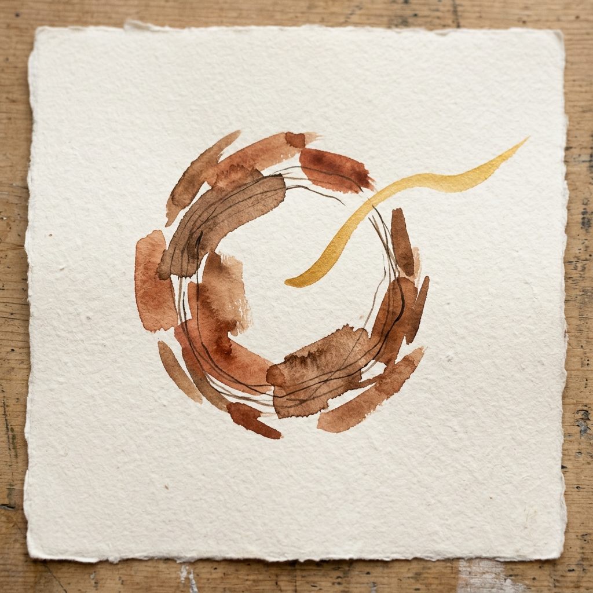

# Направление C — Warm / Soulful

### Концепция

Курс как глубина, тактильность и человечность, отражающие сторону зугиюта (Керен). Это визуальный язык, построенный на ощущении естественных материалов: бумаги, льна, туши, тёплого света. Здесь нет эзотерического китча, сердечек или мандал — только органичность и тепло (в стиле Aesop, Le Labo).

Метафора клетки — это несколько небрежных, живых мазков акварелью или тушью, образующих замкнутый круг на фактурной бумаге. И один плавный, тёплый мазок (золотой или терракотовый), который мягко выходит за пределы этого круга, символизируя обретённое дыхание.

### Палитра

| Роль | HEX | Назначение |
|---|---|---|
| Base | `#FDFBF7` | Кремовый, тёплый фон с лёгкой текстурой |
| Base-deep | `#3E2723` | Глубокий коричневый (вместо чёрного) для заголовков |
| Accent-1 | `#B87333` | Тёплый терракот (символизирует зугиют и теплоту) |
| Accent-2 | `#8D6E63` | Тёплая земля для тонких акцентов |
| Signal | `#D84315` | Приглушённый жжёный оранжевый для кнопок |
| Muted | `#8D8276` | Тауп (серо-коричневый) для длинных текстов |
| Divider | `#EAE0D5` | Бледный загар для мягкого разделения |

### Типографика

- **Заголовки (H1/H2):** `Lora` или `GT Super` — очень тёплый, humanist serif с выразительными изгибами.
- **Body:** `Manrope` — геометрический, но мягкий гротеск.
- **Обоснование:** Humanist serif даёт ощущение ручной работы, традиций и глубины (отсылка к многовековой базе Каббалы), оставаясь при этом современным и читаемым на экранах.

### Style tile

### Референсы
1.  — Aesop website aesthetic
2.  — Терапевтическая платформа Alma (тёплые тона)
3.  — Maison Margiela editorial (тактильность)
4.  — Абстрактные мазки тушью/акварелью
5.  — Тёплые фото при естественном освещении
6.  — Текстура льна/бумаги на фоне
7.  — Крупная тёплая типографика (Lora)
8.  — Приглушённый терракотовый UI

### Hero concept

